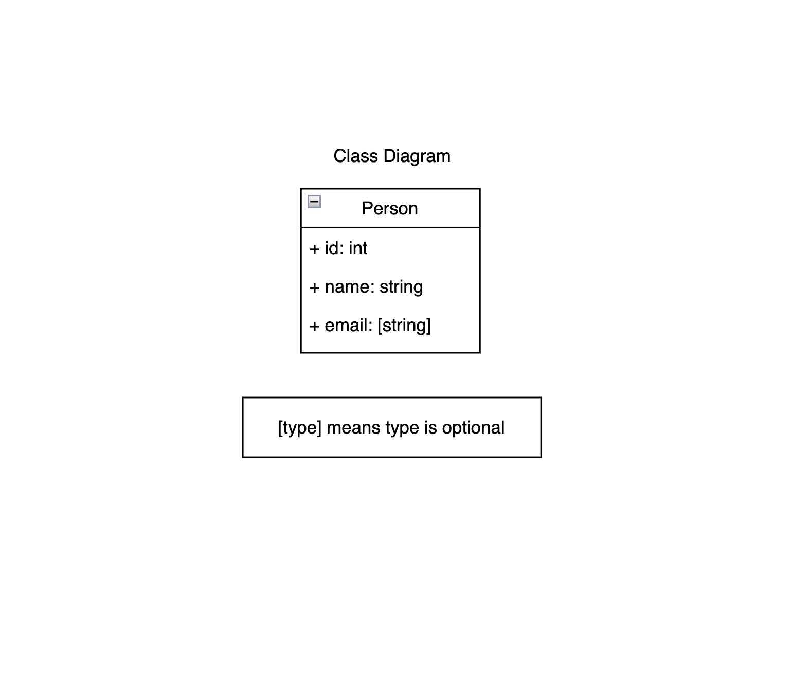

# HNGX API Documentation

## Table of Contents

- [Introduction](#introduction)
- [Base URL](#base-url)
- [Authentication](#authentication)
- [Endpoints](#endpoints)
  - [Create a Person](#create-person)
  - [Get a Single Person](#get-a-single-person)
  - [Update a Person](#update-a-person)
  - [Delete a Person](#delete-a-person)
- [Error Handling](#error-handling)
- [UML Diagram](#uml-diagram)

## Introduction

Welcome to the HNGX API documentation. This API allows you to perform basic CRUD operations on a person resource. You can create, read, update, and delete records using this API.

## Base URL

The base URL for this API is: `https://hngx-backend-s2-orzv-dev.fl0.io`

## Authentication

Authentication is required for any of the endpoints.

## Endpoints

### Create a Person

- **Endpoint:** `/api`
- **Method:** POST
- **Request Body:**

```json
{
  "name": "Mark Essien",
  "email": "markessien@hng.com" (optional)
}
```

- **Response:**

  - **Status Code:** 201 (Created)
  - **Body:**

  ```json
  {
    "id": 1,
    "name": "Mark Essien",
    "email": "markessien@hng.com" (optional)
  }
  ```

### Get a Single Person

- **Endpoint:** `/api/{userId}`
- **Method:** GET
- **Response:**

  - **Status Code:** 200 (OK)
  - **Body:**

  ```json
  {
    "id": 1,
    "name": "Mark Essien",
    "email": "markessien@hng.com" (optional)
  }
  ```

### Update a Person

- **Endpoint:** `/api/{userId}`
- **Method:** PUT
- **Request Body:**

```json
{
  "name": "Mark Essien",
  "email": "markessien@hng.com" (optional)
}
```

- **Response:**
  - **Status Code:** 204 (No Content)

### Delete a Person

- **Endpoint:** `/api/{userId}`
- **Method:** DELETE
- **Response:**
  - **Status Code:** 204 (No Content)

## Error Handling

In case of errors, the API will return appropriate status code, type of error, title, a trace id and error message where needed.

Example Error Response for Creating a Person:

```json
{
  "type": "https://tools.ietf.org/html/rfc7231#section-6.5.1",
  "title": "One or more validation errors occurred.",
  "status": 400,
  "traceId": "00-a517f679fbd230df89978edaa8406950-e5885ea468f061ae-00",
  "errors": {
    "Name": [
      "You should provide a name value",
      "You should provide a name value of at least 3 characters long"
    ]
  }
}
```

Example Error Response for Geting a Single Person:

```json
{
  "type": "https://tools.ietf.org/html/rfc7231#section-6.5.4",
  "title": "Not Found",
  "status": 404,
  "traceId": "00-84547c6677eda9c0ba5db8e3d8bef99a-f0d43591c547a460-00"
}
```

## UML Diagram

### Class Diagram


